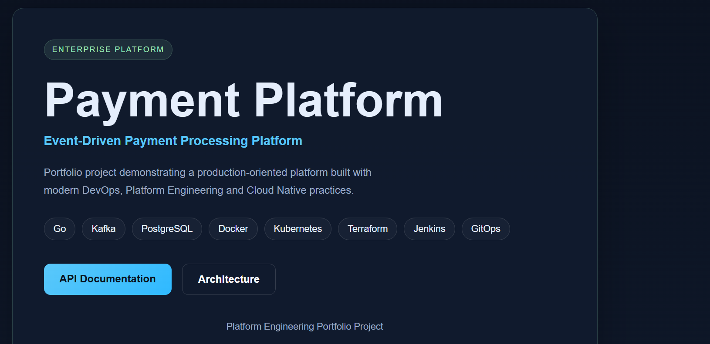
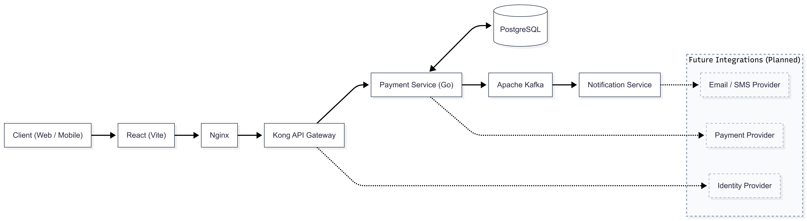
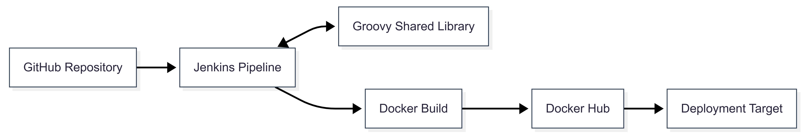

# Payment Platform

> Enterprise-Oriented Payment Platform demonstrating modern Platform Engineering, Event-Driven Architecture, AI-assisted software development, and production-grade DevOps practices.

---

## Overview

Payment Platform is an engineering project focused on designing and implementing a modern event-driven payment platform using enterprise architecture principles.

The project demonstrates practical experience in software architecture, Platform Engineering, API design, event-driven systems, CI/CD automation, and engineering documentation. Every architectural decision, implementation step, and supporting document is maintained in this repository to reflect a real software engineering workflow.

## Frontend

---

## Architecture

### Application Architecture

The platform currently includes:

- React frontend (Vite)
- Nginx
- Kong API Gateway
- Payment Service (Go)
- PostgreSQL
- Apache Kafka
- Notification Service
- Future integration points for Payment Providers, Identity Providers, and Messaging Services

---

### CI/CD Delivery Pipeline

The delivery pipeline is based on:

- GitHub
- Jenkins Pipelines
- Groovy Shared Library
- Docker
- Docker Hub

The pipeline is designed to standardize build and delivery processes while keeping deployment logic reusable through shared pipeline components.

---

## Technology Stack

### Backend

- Go
- REST API

### Frontend

- React
- Vite
- Nginx

### Messaging

- Apache Kafka

### API Management

- Kong API Gateway

### Database

- PostgreSQL

### DevOps

- Jenkins
- Groovy Shared Library
- Docker
- Docker Compose

---

## Repository Structure

| Directory | Description |
|------------|-------------|
| `api/` | OpenAPI specifications |
| `cmd/` | Go application entry points |
| `contracts/` | Event schemas and API contracts |
| `docs/` | Architecture documentation and design artifacts |
| `internal/` | Internal application packages |
| `jenkins/` | Jenkins pipelines |
| `services/frontend/` | React frontend |
| `services/payment-service/` | Payment Service |
| `docker-compose.yml` | Local development environment |

---

## Engineering Documentation

The repository contains architecture and engineering documentation, including:

- Architecture Overview
- Architecture Decision Records (ADR)
- Component Diagram
- API Design
- Domain Model
- Requirements
- Development Roadmap
- Repository Structure
- Shared Library Architecture
- Handoff Summary

---

## Current Implementation

Implemented:

- Project architecture
- React frontend
- Go Payment Service
- REST API foundation
- Docker images
- Jenkins pipelines
- Groovy Shared Library integration
- OpenAPI specification
- Event schemas
- Architecture documentation

In Progress:

- Kafka integration
- PostgreSQL persistence
- Kong API integration
- Notification Service

Planned:

- Kubernetes deployment
- Helm
- GitOps
- ArgoCD
- Monitoring and Observability

---

## AI-Assisted Engineering

The project follows an AI-assisted engineering approach.

GitHub Copilot is used to accelerate implementation, documentation, testing, and CI/CD development, while all architecture decisions, system design, and technology selection remain human-driven.

---

## Project Goal

The objective of this project is to demonstrate practical implementation of modern enterprise software architecture, Platform Engineering principles, DevOps automation, and AI-assisted software development within a production-oriented payment platform.
